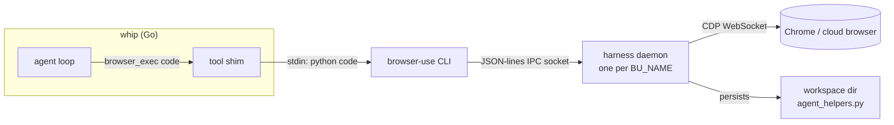
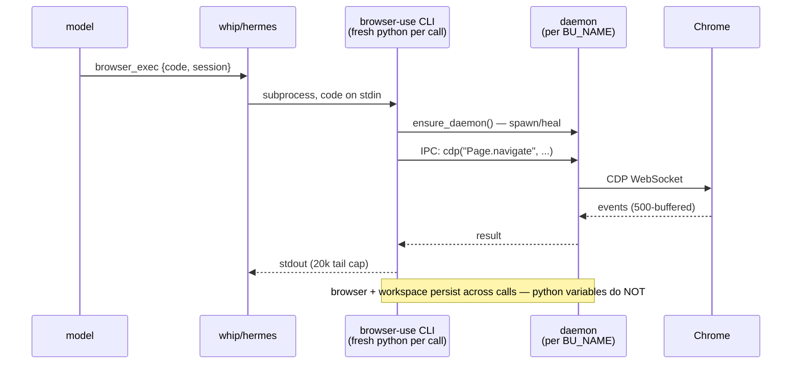
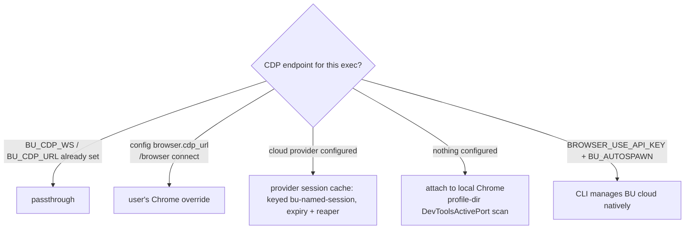
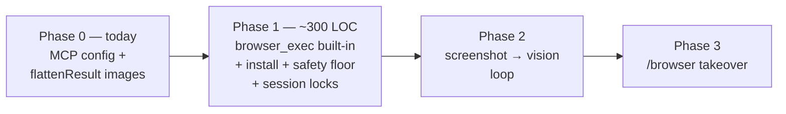

# browser-use as a first-class whip feature

> **Status: IMPLEMENTED (2026-02).** The §5b native design shipped:
> `internal/browser` (rod) + `browser_exec` tool + live/dedicated/headless
> modes + SSRF floor + screenshot→vision steering + step-label TUI rows.
> All three modes verified end-to-end against real Chromium (cookie
> round-trip on live attach; dedicated profile isolation; headless with no
> display). See docs/features.md "Browser automation".

**TL;DR — build one built-in `browser_exec` tool that pipes model-written
Python to the `browser-use` CLI's persistent CDP daemon, exactly like
hermes does.** Zero-code spike available today via the CLI's MCP server.



Exploration + ideation, 2026-02. Sources read in full or in large part:

- **browser-use substrate**: the `browser-use` pip CLI (0.13.8) is a rebranded
  thin shim over the `browser-harness` package (`browser_harness`, 0.1.9).
  Read: `run.py` (exec entrypoint), `helpers.py` (the full agent API),
  `daemon.py` (CDP holder + IPC relay), `_ipc.py` (socket plumbing),
  `admin.py` (ensure/restart/doctor/cloud), `SKILL.md` (the prompt text).
- **hermes integration** (`~/code/coding-harnesses/hermes-agent`):
  `tools/browser_use_cli.py` (886 lines — the modern `browser_exec` path,
  read in full), `tools/browser_tool.py` (5620 — legacy 12-tool stack),
  `tools/browser_supervisor.py` (1518 — persistent CDP supervisor),
  `tools/browser_cdp_tool.py`, `browser_camofox*.py`, `browser_dialog_tool.py`,
  `browser_extension_router.py`, `agent/browser_provider.py`,
  `agent/browser_registry.py`, `tools/url_safety.py` (874 — SSRF layer),
  `plugins/browser/browser_use/provider.py` (cloud REST API), and
  `website/docs/user-guide/features/browser.md`.

---

## 1. What browser-use actually is in 2026 (the substrate)

Forget the original "LLM agent library" mental model. The current
`browser-use` CLI is `browser_harness` — a **persistent CDP daemon with a
tiny helper API**, driven by piping Python to stdin:

```
browser-use <<'PY'
new_tab("https://example.com")
print(page_info())
PY
```

Architecture (`browser_harness/`):



- **`daemon.py`** — one daemon per `BU_NAME`. Holds a CDP WebSocket to a
  browser (local Chrome via profile discovery, `BU_CDP_URL`/`BU_CDP_WS`
  override, or Browser Use cloud via `BU_BROWSER_ID`). Serves a JSON-lines
  IPC socket (AF_UNIX 0600 on POSIX; TCP loopback + token on Windows).
  Request = raw CDP `{method, params, session_id}` or `{meta: ping |
  drain_events | session | current_tab | connection_status | set_session |
  pending_dialog | shutdown}`. Buffers 500 CDP events for
  `wait_for_network_idle`; tracks JS dialogs; self-heals stale CDP sessions
  (`_session_replacements` map re-routes in-flight requests to the
  re-attached session for the same tab).
- **`run.py`** — the CLI: reads code from stdin, `ensure_daemon()`, then
  `exec(code, globals())` with `helpers` star-imported. Each invocation is a
  fresh interpreter; **the browser and workspace persist, Python variables
  do not**. Output = whatever the code prints (stdout tail-capped at 20k
  chars). Also `--doctor`, `auth login`, `--reload`, `recordings`, `video`.
- **`helpers.py`** — the whole agent-facing API, ~25 functions:
  `new_tab`, `goto_url`, `wait_for_load`, `wait_for_element`,
  `wait_for_network_idle`, `page_info` ({url,title,viewport,scroll}),
  `js(expr)` (Runtime.evaluate with awaitPromise + illegal-return rewrap),
  `click_at_xy`, `type_text`, `press_key`, `fill_input` (React/Vue-safe:
  real key events + synthetic input/change), `scroll`,
  `capture_screenshot(path, full, max_dim)`, `list_tabs`/`current_tab`/
  `switch_tab`/`activate_tab`/`new_tab`/`close_tab`/`ensure_real_tab`,
  `iframe_target`, `upload_file` (DOM.setFileInputFiles), `http_get`
  (plain-HTTP escape hatch, routes through fetch-use proxy when
  `BROWSER_USE_API_KEY` set), `dispatch_key`, raw `cdp(method, **params)`,
  plus recording helpers. A user-writable
  `$BH_AGENT_WORKSPACE/agent_helpers.py` is auto-imported into every call —
  **the agent can extend its own toolbox**.
- **`admin.py`** — `ensure_daemon()`: idempotent, self-healing. Pings with a
  real CDP call (stale daemons answer `meta:ping` even with a dead browser
  socket); restarts on failure; launches Chrome if closed; opens
  `chrome://inspect/#remote-debugging` and converts Chrome 144+'s "Allow
  remote debugging?" popup into structured errors
  (`permission-blocked:`, `remote-debugging-setup:`) that read as
  *instructions to the calling agent/user*. `restart_daemon()` verifies
  daemon identity via IPC-reported PID + process start-time fingerprint
  before any SIGTERM — no stale-pid-file kills.
- **Local-Chrome attach** is profile-scan based: reads `DevToolsActivePort`
  from well-known profile dirs (Chrome/Chromium/Edge/Brave/Arc/…),
  handles Chrome 147+ disabling `/json/*` on the default profile by falling
  back to the WS path in the file. **The user's real browser, with their
  cookies and logins, is the default target** — no Playwright download.

The design constraints from its SKILL.md (7.9KB) are worth restating:
coordinate clicks by default (compositor-level CDP input passes through
iframes/shadow DOM); prefer the accessibility tree
(`cdp("Accessibility.getFullAXTree")` → filter in Python → `DOM.getBoxModel`
for coordinates) over screenshots; screenshot only when layout matters;
login walls → stop and ask.

## 2. How hermes wires it in

Two browser stacks coexist; the browser-use one is the **default**:

### 2a. The modern path: one tool, `browser_exec` (`tools/browser_use_cli.py`)

- **Exactly one tool**: `{code, session?, timeout_s?}`. `code` pipes verbatim
  to the CLI on stdin via `subprocess.run` (timeout 5–1800s, default 300).
- **CLI resolution is managed-first**: `$HERMES_HOME/bin/browser-use` (their
  own `uv tool install` copy, installed/updated by hermes) → PATH →
  `~/.local/bin` → zero-install `uvx browser-use` fallback
  (`_find_cli`, :322). `install_cli()` bootstraps `uv` itself if needed.
- **Env hygiene**: subprocess env is credential-scrubbed — all hermes
  secrets stripped, only `BROWSERBASE_*`/`BROWSER_USE_API_KEY`/`FIRECRAWL_*`
  re-added (`_build_browser_env`, browser_tool.py:128). `PYTHONPATH`/
  `PYTHONHOME` popped so the CLI's Python can't import hermes's venv.
- **URL pre-flight**: `http(s)://` literals in the code are extracted and run
  through `evaluate_url_safety` before exec (`_blocked_url_in_code`, :96).
  Best-effort — only literals, not JS strings built at runtime.
- **Named sessions**: `session=<name>` → `BU_NAME` env → own daemon (own
  IPC socket/pid/log). On cloud backends the name also keys the provider
  session cache (`bu-named-<name>`) so each name gets its **own cloud
  browser**. On shared local Chrome, a preamble (`_OWN_TAB_PREAMBLE`, :40)
  pins each named daemon to a tab it created — concurrent sessions stop
  clobbering one tab. The daemon itself has the same rule
  (daemon.py `attach_first_page`: `NAME != "default"` → dedicated tab).
- **Backend composition** (`_resolve_backend_cdp`, :503):



  Explicit
  `BU_CDP_WS/URL` passthrough → `browser.cdp_url` override (`/browser
  connect`) → configured cloud provider's CDP URL (reusing the legacy
  stack's per-task session cache with expiry/reaper) → local Chrome.
  Browser-Use-direct-key configs skip provider resolution entirely and let
  the CLI manage cloud browsers natively.
- **Workspace**: `$HERMES_HOME/cache/browser-use/workspace/<task_id>` as
  `BH_AGENT_WORKSPACE`; multi-item extractions append to JSON/CSV there so
  progress survives timeouts; `agent_helpers.py` for reusable functions.
- **Vision**: stdout is regex-scanned for screenshot paths
  (`_IMAGE_PATH_RE`, handles Windows drive letters after #83884). When the
  active model supports native vision, the tool result becomes multimodal:
  PNG resized to ≤256KB/1568px **JPEG** data URL + "inspect it with your
  native vision". History-bloat acknowledged: the data URL bakes into the
  tool result and is re-sent every later turn (#92699 comment).
- **Dynamic description**: `_HEADER_BASE` (persistent-state + batching +
  workspace discipline) + `_HEADER_VISION` *or* `_HEADER_TEXT_ONLY`
  depending on model capability, + a pinned `_HELPERS_DIGEST`. They removed
  the live `browser-use skill` fetch: "supply-chain exposure, byte-unstable
  prompt"; A/B benchmark (108 runs): header-only == full skill dump at 36/36
  task success, −60% tokens vs the 12-tool legacy set. Instructs the model
  to start `code` with a ≤60-char plain-language comment — the TUI shows it
  as the step label (`agent/display.py:430`).
- **Gating**: `browser_exec` executes arbitrary Python ⇒ sessions without
  the `terminal` toolset never see it (`model_tools.py:580`).
- **Graceful degradation**: schema fallback text when CLI missing ("Install
  it with `uv tool install browser-use`"); once-per-24h downgrade notice
  when silently fallen back to legacy tools.

### 2b. The legacy stack (`browser_tool.py` + friends) — being displaced

12 granular tools (`browser_navigate/_snapshot/_click/_type/_scroll/_back/
_press/_get_images/_vision/_console/_cdp/_dialog`) on an accessibility-tree
model (`@eN` refs). **The actual driver is a Node CLI called
`agent-browser`** (Playwright inside), spawned per command with JSON on
stdout; this file is a 5.6k-line orchestration layer around it: backend
selection, per-task session lifecycle, safety, content shaping. The
interesting machinery hermes built around it:

- **Content shaping** (the best idea in the file): compact a11y snapshot
  auto-attached to every navigate; >15k chars → LLM-summarize (aux model,
  secret-redacted both directions, refs preserved) or line-boundary
  truncate, with the **full snapshot always spilled to a
  content-hash-deduped file** and a pointer the agent pages with
  `read_file offset/limit` — exactly whip's `@`-mention philosophy.
- **Process hygiene**: stdout/stderr to temp files, not pipes (the daemon
  inherits pipe FDs, so `communicate()` never sees EOF); per-session socket
  dirs with owner-PID files; a cross-process orphan reaper that verifies
  daemon identity via psutil before killing; idle reaper (120s default) +
  `AGENT_BROWSER_IDLE_TIMEOUT_MS` self-termination; provider-authoritative
  `expires_at` replacement; cloud→local fallback on provider failure,
  annotated in the result.

- **`browser_supervisor.py`** — per-task in-process CDP WebSocket supervisor
  on a dedicated thread+event loop. Reconnect loop with backoff (Browserbase
  drops the socket whenever a short-lived client disconnects). The standout
  hack: a **dialog bridge** — inject JS via `Page.addScriptToEvaluateOnNewDocument`
  overriding `alert/confirm/prompt` to fire a *synchronous XHR* to
  `hermes-dialog-bridge.invalid`, intercept it with `Fetch.enable`, park as
  `PendingDialog`, resolve via `Fetch.fulfillRequest`. Turns the
  native-dialog race through proxies into a deterministic request/response.
  Policies `must_respond|auto_dismiss|auto_accept` + per-dialog watchdog +
  `recent_dialogs` ring buffer with `closed_by` provenance. Frame tree
  capped at 30 entries/OOPIF depth 2 with `truncated` flag. Frozen
  snapshots as the tool-facing read API.
- **`browser_cdp_tool.py`** — raw-CDP escape hatch with an SSRF guard:
  on private/internal pages only a method allowlist passes, and navigate
  targets/eval expressions are screened for private URL literals.
- **Provider abstraction** (`agent/browser_provider.py`): 5-method ABC
  (`name/is_available/create_session/close_session/emergency_cleanup`), no
  network in `is_available` (runs at startup paint). Registry selection:
  explicit config wins even when unavailable (precise error, no silent
  rerouting); auto-detect walk restricted to a safe preference list —
  Firecrawl deliberately excluded because its API key is shared with the
  web-extract plugin.
- **`browser_use` cloud provider** (`plugins/browser/browser_use/`):
  `POST /api/v3/browsers` → `{id, cdpUrl, timeoutAt}`; stop via
  `PATCH /browsers/{id} {"action":"stop"}`; idempotency keys on create
  retries in managed (Nous-gateway) mode; default `proxyCountryCode: "us"`.
- **Camofox** — Camoufox (anti-detect Firefox) REST backend, 1:1 tool
  interface, persistent profile identities via uuid5 of the state dir,
  noVNC URL surfaced in navigate results so the user can watch live.

### 2c. The SSRF floor (`tools/url_safety.py`)

Two-tier: `is_always_blocked_url` (cloud metadata: 169.254.169.254,
metadata.google.internal, ECS task metadata — blocked unconditionally,
checks every DNS answer, **fires even for local backends** since a local
Chromium on a cloud VM still reaches host IMDS) and `is_safe_url` (all
private/loopback/link-local/CGNAT ranges, fail-closed on DNS errors), with
`browser.allow_private_urls` escape for the LAN/hybrid-routing case (cloud
for public URLs, local Chrome sidecar for intranet). IPv4-mapped IPv6
handled. The navigate path adds: secret-regex on raw+decoded+normalized
URL; credential-like query-param blocking on cloud backends only;
**post-redirect recheck** (final URL hitting the floor → navigate to
about:blank and block); and a current-URL re-probe before every
content-returning tool, closing the "JS eval navigated the page" hole.

## 3. What whip has, honestly assessed

- Tool interface is one struct (`Tool{Def, Run}`), adding a built-in is
  ~40 lines; output budget 50KB shared with MCP.
- `runTools` parallelizes; bash takes a global lock. A `browser_exec` lock
  per session name slots into `filelocks.go`'s channel-semaphore idiom.
- Vision: `TurnWithImages` + `llm.ImagePart` exist; `Model.Vision` flag in
  config gates `@image` inlining (tui.go:2394). **But tool results are
  text-only today** — `Message.Parts` only flows on *user* messages.
- Subagents: `task.go` `sub.Tools = tools.All()` — a browser built-in
  automatically appears in subagents; `background:true` tasks run
  concurrently ⇒ multiple agents may share one browser. Session namespacing
  is not optional, it's load-bearing.
- MCP client is mature — browser-use ships **two** MCP servers
  (`browser_use.mcp.server` — the full agent-library tools; and
  `browser_use.mcp.cli_mcp` — a stdio server exposing exactly
  `browser_exec` + `browser_screenshot` with a persistent namespace and an
  exec lock). The second one is hermes's design pre-packaged as MCP,
  including native `ImageContent` screenshot returns.
- Config: `~/.whip/config.json` sections.

## 4. Integration options, re-ranked with evidence

### A. Built-in `browser_exec` tool wrapping the CLI subprocess (hermes port)

~250 lines of Go in `internal/tools/browser.go`: find CLI
(`~/.whip/bin/browser-use` → PATH → `uvx`), stdin-pipe code with
`BU_NAME=<session>` + scrubbed env, regex-scan stdout for screenshot paths,
return JSON-ish text. Port hermes's `_HEADER_BASE`+digest description
(verbatim steal — it's benchmarked) with a vision-aware variant.

*New information from reading the substrate*: the CLI auto-starts and
self-heals its daemon (`ensure_daemon`), including structured "go click
Allow in Chrome" errors — whip inherits all of that for free. The
subprocess-per-call cost is real but the daemon holds the browser; hermes
ships this as their SOTA path.

The one thing to fix in the port: **make the tool result able to carry
images**. Options: (a) extend `Message.Parts` to tool messages (wire format
already supports content-part arrays on any message; repair code at
openai.go:229 only cares about tool_call_id matching) and have the tool
return parts; (b) simpler: on screenshot detection, inject a follow-up
*user* message with the image part — reuses `TurnWithImages` plumbing with
zero wire changes, matches how the `!` escape already shares output with
the model. (b) is the ponytail move; (a) is cleaner long-term.

### B. MCP: point whip at `browser-use` = zero-code validation, maybe more

`browser-use` CLI exposes `browser_use.mcp.cli_mcp`: stdio MCP server,
**two tools** (`browser_exec`, `browser_screenshot` returning real
`ImageContent`), persistent namespace, exec lock. Today this works via
`~/.whip/config.json` mcp block with zero new code — except whip's MCP
bridge flattens results to text (`flattenResult`, manager.go:456), so
`browser_screenshot`'s ImageContent lands as a placeholder. Two gaps to
close for parity: (1) teach `flattenResult` to save image content to a temp
file and return the path (tiny), and (2) image-carrying tool results (same
gap as option A). This is the **fastest honest spike** and stays useful as
the "users who already configured it" path even after a built-in lands.

### C. Native Go CDP (chromedp/rog-pike) — now with a concrete floor

Reading `daemon.py`+`admin.py`+`helpers.py` shows the actual scope: CDP WS
client + profile discovery + daemon lifecycle + ~25 helpers + dialog
handling + session self-heal ≈ 3.5k lines of battle-tested Python with
dozens of edge-case fixes (Chrome 144 popup, 147 /json lockdown, stale
DevToolsActivePort, PID-reuse-safe kills, OOPIF sessions, network-idle
event filtering). A Go port is *feasible* (task-3's report maps it cleanly
onto goroutines/channels — and the dialog-bridge JS is verbatim reusable)
but it's a multi-week project that then tracks a fast-moving upstream.
Only worth it if the Python dependency becomes a dealbreaker for whip's
single-binary story.

## 5. The design I'd actually build



**Phase 0 (today, config-only)**: document the `cli_mcp` MCP config in
features.md; fix `flattenResult` to spill image content to temp files.
Validates workflows end-to-end.

**Phase 1 — `browser_exec` built-in (~300 lines + tests)**:
- `internal/tools/browser.go`: `browser_exec{code, session?, timeout?}`.
  CLI resolution managed-first into `~/.whip/bin`, `uv tool install`
  bootstrap behind `/browser install`, `uvx` fallback.
- Env scrub: build the subprocess env from scratch (PATH floor + HOME +
  `BU_*` + `BROWSER_USE_API_KEY`), never inherit whip's env wholesale —
  whip's process env carries provider API keys.
- URL-literal pre-check: port `is_always_blocked_url`'s floor (metadata
  endpoints, every DNS answer) as ~60 lines of Go; block literals in `code`.
  Respect a `browser.allowPrivateUrls` config for the LAN case.
- Per-session serialization through `filelocks`-style semaphores keyed
  `browser:<session>`; global lock is wrong (named sessions are designed
  for concurrency), no lock is wrong too (two calls to one daemon
  interleave).
- Description: steal `_HEADER_BASE` + helpers digest + step-label comment
  convention; swap vision/text-only section on `Model.Vision`.
- Default `session` = whip session id; subagents get `<session>-<taskID>`;
  document "same name = same browser" in the schema.
- TUI: tool row shows the `# comment` first line as the label (generalize
  the existing `⚒ name args` row to special-case browser_exec's first
  comment line); `/browser` command = `--doctor` + `connection_status` +
  install/connect/status subcommands.
- Workspace: `~/.whip/browser/<session>/` as `BH_AGENT_WORKSPACE`.

**Phase 2 — vision loop**: screenshot-path detection (port `_IMAGE_PATH_RE`)
→ resize (1568px/256KB JPEG — needs an image lib; `golang.org/x/image` +
jpeg re-encode, no cgo) → attach. Start with the user-message injection
(5b); graduate to tool-message parts if providers behave.

**Phase 3 — takeover**: `browser.headed`/`cdpUrl` config +
`/browser connect` for human takeover; login-wall rule already in the
description; consider the `browser_screenshot` separate tool from cli_mcp
as a second built-in (cheaper than exec for pure observation).

**Deliberately not now**: cloud provider REST (BU_AUTOSPAWN + `auth login`
covers it via the CLI), supervisor/dialog bridge (only matters for
native-Go), Camofox, recordings (the CLI has them; revisit if users ask).

## 6. Gotchas discovered while reading (save these)

1. The pip CLI **rebrands** browser-harness strings at runtime
   (`_as_browser_use_cli_text`) — error text may say either name.
2. Chrome 144+: per-connection "Allow remote debugging?" popup; 147+:
   `/json/*` disabled on the default profile. The harness handles both, but
   error strings (`permission-blocked:`, `remote-debugging-setup:`) are
   part of the agent-visible contract — don't swallow stderr.
3. `browser-use`'s shipped SKILL.md contains promotional content (cloud
   upsell line, "ask the user to close billing browsers" phrasing that
   nudges cloud usage) — exactly why hermes pins its own digest. Whip
   should likewise never pipe `browser-use skill` output into prompts.
4. Screenshot data URLs baked into tool results are re-sent on every
   subsequent request — hermes caps at 256KB JPEG and still flags it. With
   whip's 50KB *text* truncation not applying to parts, an unguarded
   screenshot history would silently blow context: compact's
   `EstimateTokens` counts 1200 tokens/image part already.
5. `BU_NAME` accepts only `[A-Za-z0-9_-]{1,64}` — validate before env-set
   (hermes does; the daemon path-traversal-guards too).
6. Helpers star-import a user/agent-writable `agent_helpers.py` from the
   workspace — that's code execution persisting across calls. Powerful
   (the agent extends its own tools) but document it as a safety concern.
7. Windows: daemon IPC is TCP loopback + token; the CLI hides console
   windows; screenshot paths are drive-letter form. Whip's Windows support
   is currently minimal — fine to ship POSIX-first, say so.
8. The daemon's local-Chrome mode *attaches to the user's real browser* —
   cookies, sessions, everything. That's the feature (logged-in work) and
   the hazard (the agent acts as the user). Step-label visibility and
   `/browser status` are what make it acceptable.
9. Legacy-stack lessons that transfer to whichever path whip ships:
   daemon-spawning commands must redirect stdout/stderr to **files, not
   pipes** (inherited FDs keep pipes open forever); kill process **trees**
   (npm/daemon grandchildren survive a plain kill); treat rc=0 + empty
   stdout as failure; rewrite timeout errors into actionable hints at the
   boundary. And the anti-lesson: hermes's regex-based JS-vocabulary
   denylist (`document.cookie` etc., incl. deobfuscation attempts) is off
   by default and losing — guard egress (URL rechecks), not vocabulary.

---

## Addendum (2026-08): hermes `/browser connect` auto-launch port

Shipped in `.ai-docs/plans/browser-auto-launch` — live mode no longer
dead-ends on `ErrNoLiveBrowser`. Ported from hermes's
`hermes_cli/browser_connect.py` + `cli_commands_mixin.py` `/browser connect`:

- **Auto-fallback**: `Open`/`openRod` fall back from `live` to launching the
  dedicated Chrome when discovery finds nothing debuggable. hermes does the
  same on `/browser connect` ("isn't running with remote debugging —
  attempting to launch..."), but into an isolated `~/.hermes/chrome-debug`
  profile; whip reuses its existing `~/.whip/browser/dedicated-profile`.
- **Dual-stack probe** (`_LOOPBACK_PROBE_HOSTS`): a non-Chrome squatter on
  127.0.0.1:9222 pushes Chrome's debug port to [::1] only — probe both.
- **Squatter rejection**: `/json/version` must return a Chromium `Browser`
  field; a squatter's 404 HTML is not a browser. The Chrome-147+ wsPath
  fallback now additionally requires the file's WS path to answer a
  WebSocket upgrade (101) before trusting it — otherwise a stale
  DevToolsActivePort pointing at a squatted port hands rod a bogus ws URL.
- **Reattach-no-duplicate**: a still-running whip Chrome is reattached via
  its profile's DevToolsActivePort instead of spawning a second instance.
  Two discoveries while building this: (1) rod's `Browser.Close()` always
  sends CDP `Browser.close`, which kills the *whole* browser process even on
  a remote attach — whip now detaches (severs the socket via reflect+unsafe
  into rod's unexported client) for live/reattached/dedicated modes and only
  kills headless; (2) that detach survives because the launcher's Leakless
  pid-guardian reaps the browser when the agent process exits, so detached
  dedicated Chromes don't leak across runs.
- The in-band fallback notice (prepended to the first tool output) is
  hermes's `_pending_input` "browser connected to live browser" context
  injection, adapted: whip tells the model *which* browser it's driving
  (launched dedicated vs attached live) so it can relay that to the user.

---

## Addendum (2026-08, second): extension relay — driving the user's real tab

Shipped in `.ai-docs/plans/browser-extension` (`internal/browser/extrelay/`):
`browser.mode: "extension"` routes `browser_exec` to the user's real,
logged-in Chrome tab — the one thing the auto-launch fallback *can't* do on
Chrome ≥ 136, where CDP on the default profile is blocked entirely.

- **Mechanism**: an MV3 extension (`chrome.debugger`) holds an outbound
  WebSocket to a loopback relay and pipes raw CDP to the pinned tab. The
  relay hands rod a browser-level `/cdp` endpoint, synthesizing the few
  browser-level `Target.*` responses (getTargets/attachToTarget/
  setDiscoverTargets) a single-tab debugger session can't answer, and
  tunnels everything else verbatim — so the existing rod Backend is reused
  unchanged. Chosen over an OpenClaw-style content-script driver (design B)
  because chrome.debugger gives full CDP (trusted input, screenshots, AX
  tree) with zero second-driver code; the cost is Chrome's "… is debugging
  this browser" infobar while pinned.
- **WebSocket server with zero new deps**: `gobwas/ws` (already vendored via
  rod) — but two hard-won quirks: (1) gobwas's `ws.UpgradeHTTP` rejects
  rod's literal non-base64 `Sec-WebSocket-Key: nil`, and rewriting the key
  breaks the accept hash rod verifies against the key *it* sent — so the
  relay does a manual handshake (`base64(sha1(key + magic))` over whatever
  key arrived). (2) A shared `bufio.ReadWriter` deadlocks (a write flush
  resets the read buffer mid-read); reads and writes must use separate
  buffers over the socket.
- **rod gotcha that cost an hour**: `Browser.Context()` shallow-copies
  (`newObj := *b`), so `b.Context(ctx).Connect()` sets the client on the
  *copy* — calling `Pages()` on the original then nil-derefs `b.client`.
  Connect and use the same object.
- **rod's Eval is `Runtime.callFunctionOn`**, not `Runtime.evaluate`, and
  `PageFromTarget` immediately issues `Emulation.setDeviceMetricsOverride` +
  `Page.enable` — the extension must answer all of them (or chrome.debugger
  does, since it forwards everything).
- **Install UX**: Chrome forbids programmatic extension install, so
  `whip browser install` writes the unpacked extension + `relay.json`
  (per-process bearer token, 0600), mints the token, and opens
  `chrome://extensions` + the folder — the user's part is exactly three
  clicks (Developer mode → Load unpacked → select folder), then click the
  extension icon on a tab to pin it.
