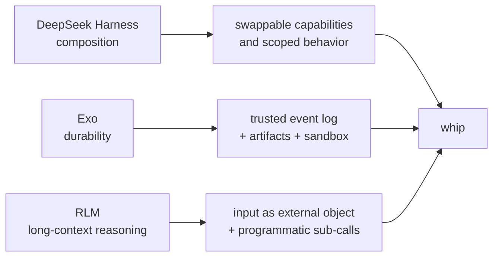

# Three directions for agent harnesses: DeepSeek, Exo, and RLMs

Researched 2026-08-29. This is a design note, not a recommendation to adopt
any of these systems wholesale. It asks a narrower question: **which ideas make
whip more capable, inspectable, and economical without losing its small,
single-binary character?**

The three projects attack different bottlenecks:

| Work | The scarce resource it addresses | Core move |
| --- | --- | --- |
| [DeepSeek Harness](#1-deepseek-harness-composition-that-can-be-undone) | Harness evolution | Make every capability a composable, removable plugin. |
| [Exo](#2-exo-recursion-with-a-trusted-memory) | Safe, long-lived autonomy | Separate mutable policy from an append-only, trusted substrate. |
| [Recursive Language Models (RLMs)](#3-rlms-make-the-input-an-environment) | Long, information-dense inputs | Keep the input outside the model and let it be inspected and decomposed by code. |

Their shared message is subtle: do not solve every problem by putting more text
in the next model call. Give the agent durable state, a precise capability
boundary, and an explicit way to manipulate the state. But their designs are
not interchangeable:

The recurring architectural choice is to preserve a complete source of truth
and derive the model's much smaller working view from it. DeepSeek applies this
to session history, Exo to a long-running agent's life, and RLMs to the user
input itself.

## 1. DeepSeek Harness: composition that can be undone

[DeepSeek Harness (`dsh`)](https://github.com/deepseek-ai/deepseek-harness)
is an MIT-licensed, developer-preview harness built on Cordis. Its unusually
strong claim is that **models, tools, skills, sessions, sandboxes, storage,
loops, scheduling, and the UI are all plugins**, rather than fixed kernel
features. The project should be treated as a fast-moving reference design, not
a stable dependency: its own README warns that compatibility-breaking changes
are expected during preview.

### The interesting implementation choices

#### A plugin is an effect with a cleanup path

Cordis's distinctive contribution is not simply dependency injection. A plugin
registers services, events, and effects in a shared context; its registrations
are unwound when it unloads. The accompanying Cordis paper calls this
*temporal composability*: an implementation must be able to reverse the effects
it introduced. It complements *spatial composability*, where a component
declares the dependencies that govern when it should activate.

That is much stronger than an ordinary Go interface seam. A feature can be
loaded, reconfigured, and removed without leaving stale routes, event handlers,
tools, or background work behind. The model adapter, tool registry, session
log, and agent loop are deliberately all replaceable.

**Lesson:** design mutations with an inverse. For whip, the practical version
is not a general hot-plugin runtime. It is making lifecycle ownership explicit:
every dynamic registration (an MCP server, background task, future agent preset,
or provider) should have one owner and a deterministic `Close`/unregister path.
That prevents a class of duplicated-tool, orphaned-goroutine, and stale-context
bugs before extensibility becomes important.

#### Profiles are declarative compositions, not code forks

`dsh` starts a profile—an ordered stack of bundles and patch files. A profile
can replace any row in the resulting plugin tree; custom profiles can live
reload. The shipped Web, headless, SDK, minimal-SDK, and ACP products are
different compositions, rather than separate binaries with copied setup code.
The architecture guide makes `dsh --dump-config` a first-class way to inspect
the actual tree that booted.

**Lesson:** expose the *effective* configuration, not just the inputs. Whip
already combines CLI flags, config, provider discovery, skills, MCP, and
workspace instructions. A read-only `/context-doctor` is the right instinct;
the related next step is a compact "why this is enabled" view for a model,
tool, or instruction. That is more useful than adding a generic plugin format.

#### The agent contract is independent of the default loop

`dsh-agent` owns an `Agent` handle and registry, while `dsh-agent-loop` merely
supplies the default driver. UI, hooks, and orchestrators depend on the handle,
not on the loop. Per-agent scoped registrations can add tools, prompt sections,
or event listeners to one agent and automatically unwind when it is disposed.

This separation lets a subagent have a different capability set without
changing its siblings. It also makes steering, injected context, cancellation,
and waiting-for-idle explicit operations rather than UI special cases.

**Lesson:** distinguish the conversation/agent API from the agent loop. Whip
does not need loops-as-plugins, but a small internal agent handle would make
subagent controls, human steering, and task-specific toolsets easier to evolve
without overloading the main TUI model.

#### The log is the source of truth for model context

`dsh` makes a strong invariant: **anything the model sees must be recoverable
from the durable session log.** It stores chunks for replay fidelity, derives
model history from the log, and represents turns, steps, messages, tools, and
request headers as durable session events. Live `agent/*` events and capability
events are separate extension mechanisms; only durable facts enter the session
history.

This is an excellent standard. It captures a frequently missed detail: the
system prompt, injected context, and tool schemas are part of the causal record,
not invisible harness implementation. Without them, a replay answers “what the
model said,” but not “why it was able to say it.”

**Lesson:** keep whip's session store as raw evidence and make its derived
prompt view inspectable. Existing recorded compactions are a good start. If
whip adds task-specific context, recursive execution, or dynamically scoped
tools, it should log the *materialized request view or a reproducible recipe*
for it, with secret values redacted. This should be a correctness invariant,
not a debugging convenience.

### What not to import from DeepSeek Harness

Everything-as-a-plugin is powerful because Cordis has a formal model and a
large TypeScript runtime behind it. Copying the surface pattern into a compact
Go TUI would create configuration and lifecycle machinery before there are
enough independently evolving consumers. Prefer narrowly scoped interfaces and
observable effective configuration; promote a seam only after at least two real
implementations need it.

## 2. Exo: recursion with a trusted memory

The existing [Exo learning note](exo.md) has the code-level survey. This
section records the cross-cutting lesson from the current Exo source:
**make policy mutable, but protect the evidence that lets the agent recover from
bad policy.**

Exo is a long-running personal agent designed to improve itself. It can modify
prompts, tools, memory, and much of its own code; clone itself; snapshot or
rewind its sandbox; rebuild; restart; and use external-channel adapters. The
thing it deliberately protects is the canonical, append-only event log.

### The interesting implementation choices

#### Exoharness is a substrate, not an agent loop

Exo separates the **exoharness** from the **executor**:

- The exoharness owns durable conversations, sessions, turns, append-only
  events, versioned artifacts, bindings, secrets, and sandboxes.
- The executor owns semantic choices: prompt assembly, model selection,
  compaction, memory policy, approval UX, and tool-loop behavior.

The substrate intentionally stops before an LLM call, because making that call
requires policy. This is the cleanest answer to the tension between safety and
future flexibility: protect the minimal stateful primitives, but do not freeze
today's agent strategy into them.

**Lesson:** preserve the distinction between mechanism and policy. Whip should
keep session durability, secret indirection, process cleanup, and workspace
snapshots trustworthy; choices such as when to compact, which model to use for
a subtask, and how to summarize an artifact should remain replaceable policy.

#### "Rewind" the world, never erase the evidence

Exo's sandbox snapshots restore filesystem state but append a new record to the
event log. Conversation forks create a new history with provenance. These are
different operations, and neither silently deletes the failed attempt. A retry
can therefore know what failed instead of looping through the same repair.

**Lesson:** the same rule applies beyond files. A cancellation, discarded
summary, tool timeout, budget denial, or rejected plan can be valuable evidence
for the next attempt. Store it as a named event instead of allowing it to vanish
inside control flow. Whip has already adopted much of this stance in recorded
compaction, crash recovery, and workspace snapshots; keep it as the default for
new autonomy features.

#### Artifacts are a better memory boundary than an ever-growing prompt

Exo's memory, todos, skills, and snapshots are versioned artifacts, injected
with explicit caps or read on demand. The durable conversation is not the
prompt: an executor can create a compacted or otherwise derived view while the
full log remains queryable.

**Lesson:** use a named artifact when information needs a lifecycle, an owner,
or an audit trail. This is preferable to quietly appending more system text.
That choice will be especially important if whip adds long-document or
repository-analysis workflows: evidence ledgers, plans, and summaries should
be durable objects with links back to their source, not just opaque transcript
text.

### What not to import from Exo

Exo needs rebuild/restart, remote adapters, and broad self-modification because
it is a persistent autonomous system. Whip is an interactive coding TUI. Giving
the model authority to rewrite the harness or its host environment would be a
different product with substantially different safety and operator requirements.
The useful transfer is its durability discipline, not its level of autonomy.

## 3. RLMs: make the input an environment

The [RLM paper](https://arxiv.org/html/2512.24601v3) introduces a general
inference scaffold around a base model with a fixed context window. Instead of
placing a potentially enormous prompt in the model context, it stores the input
as a value in a persistent REPL. The root model receives only bounded metadata
and writes code that inspects, partitions, transforms, and recursively queries
the input. Intermediate values and the final response also live in the REPL.

The important reframing is: **the long prompt is an object the model can work
on, not a blob it must repeatedly remember.**

### Three design choices that distinguish RLM from ordinary tool use

1. **A symbolic handle to the prompt.** The model can slice or search the input
   without copying it into the root context window.
2. **A symbolic final value.** The answer can be built in the environment and
   returned from `Final`; it is not bounded by a single `Finish` action's
   response.
3. **Programmatic recursion.** Code in the environment can call a sub-model or
   sub-RLM inside loops over constructed slices. A model is not limited to
   verbalizing a handful of individual subagent calls.

The third point is the real distinction. A coding agent that can read a file
and call a subagent is not automatically an RLM: if it repeatedly places the
whole input and all intermediate results in its own transcript, it eventually
returns to compaction and context rot.

### Results worth paying attention to—and their bounds

The latest RLM paper version reports strong results on four tasks that vary in
how much computation is required as input length grows: needle retrieval,
multi-document research, linear aggregation, and quadratic pairwise
aggregation. It reports that an RLM using GPT-5 with depth one handled a
6–11M-token BrowseComp-Plus corpus for $0.99 on average and scored 91.3%, while
the paper's extrapolated GPT-5-mini direct-ingestion cost was $1.50–$2.75. It
also reports large gains on the dense OOLONG-Pairs task, where base models had
near-zero F1.

Those numbers are promising, but they are not a blanket claim that recursion
is free or always better:

- The same paper shows performance and cost varying substantially by model,
  benchmark, and depth; root/submodel capability matters.
- It uses a purpose-built Python REPL and a prompt that teaches the model its
  conventions. A generic shell tool is not equivalent.
- The evaluation is about long-context tasks, not ordinary coding turns.
- The harness must protect the REPL, cap recursive work, and record each
  sub-call. An unconstrained recursive tool is a cost and reliability hazard.

The paper's most practical result may be training. Fine-tuning Qwen3-8B on
1,000 filtered RLM trajectories improved its median score by 28%; this hints
that small models can learn the *controller* role—manipulating state and
launching calls—even when they are not the best workers for every leaf task.

### Follow-on work: the useful disagreements

The RLM literature is very young. The following papers are preprints, so their
results should be read as evidence to test rather than settled guidance.

| Follow-on | Contribution | Lesson for harness design |
| --- | --- | --- |
| [Think, But Don't Overthink](https://arxiv.org/abs/2603.02615) | An independent reproduction using DeepSeek v3.2 and Kimi K2 found that depth one can help complex tasks, while depth two can degrade quality and expand time from 3.6s to 344.5s in its reported setup. | Recursion depth is a budgeted decision, not a quality knob. Start at one level and choose it based on task complexity and measured marginal value. |
| [Recursive Models for Long-Horizon Reasoning](https://arxiv.org/abs/2603.02112) | Gives a theoretical argument for isolated recursive contexts and trains a 3B model to follow recursive reasoning on SAT and Go-style search. | The interface matters, but training matters too. A capable root must learn decomposition, call/return, and state discipline; scaffolding alone will not make every model recursive. |
| [$\\lambda$-RLM](https://arxiv.org/abs/2603.20105) | Replaces arbitrary REPL code with typed, pre-verified functional combinators and claims termination and cost bounds, plus better results in 29 of 36 model-task comparisons. | For a product harness, expose a small structured algebra (`map`, `filter`, `reduce`, `partition`, `call`) before offering an unrestricted recursive REPL. It is easier to sandbox, meter, debug, and cache. |
| [Chained RLM](https://arxiv.org/abs/2608.05124) | Uses fresh root contexts connected by a short summary, a blackboard, and durable artifacts, so later roots can inspect and correct earlier work instead of inheriting its entire trajectory. | Treat checkpoint boundaries and evidence artifacts as first-class. A fresh reviewer with an auditable ledger can be more valuable than a deeper call stack. |
| [TimeRLM](https://arxiv.org/abs/2608.03391) | Applies the external-context idea to long time-series anomaly localization. | The abstraction generalizes beyond text: keep a large, structured input in a domain-native store and give the model bounded, purposeful operations over it. |

The apparent conflict between the original paper's deeper-recursion gains on
some dense tasks and the reproduction's overthinking is useful rather than
alarming. Together they imply a policy: recursion should be adaptive, observable,
and easy to stop—not blindly deeper.

## 4. The combined design: explicit state at three scales

These systems fit together as a useful hierarchy:

| Scale | Preserve | Derive for the next model call | Strongest source |
| --- | --- | --- | --- |
| Harness lifetime | Durable events, artifacts, secrets, sandbox snapshots | Executor policy and a compact prompt view | Exo |
| One agent/session | Full causal session log, tool schemas, injected context | Model history and scoped capabilities | DeepSeek Harness |
| One long task | Original input, intermediate evidence, sub-call outputs | Bounded slices and task-specific aggregates | RLM |

The rule is the same at every scale: **retain raw state; derive a bounded view;
record the derivation.** This avoids two costly failure modes:

- *opaque compaction*: a summary loses evidence, then no one can reconstruct
  why the next answer is wrong;
- *unbounded accumulation*: every event is injected forever, so correctness
  and cost both deteriorate.

## 5. Concrete implications for whip

Whip should not become a generic runtime or a self-modifying daemon. The
highest-value path is a small, evaluated long-context capability that builds on
its existing durable sessions, memory, recorded compaction, subagents, and
workspace snapshots.

### A safe RLM-shaped experiment

Before adding a user-facing feature, build an internal benchmark and prototype
with these constraints:

1. **Keep the source external.** Put a large document set or repository snapshot
   behind a stable handle; do not inject it wholesale into the transcript.
2. **Expose bounded primitives first.** Support explicit read ranges, search,
   partition, and a metered subtask call. Return short structured results and
   save larger evidence in a named artifact.
3. **Default to depth one.** Give the root a call-count, concurrency, token,
   time, and dollar budget. Require an explicit policy decision before a
   recursive child can create its own children.
4. **Log the causal graph.** Record source version/ranges, parent-child calls,
   prompt recipe (with secrets redacted), result artifact ids, and budget
   decisions. This makes cost and failures inspectable from the transcript.
5. **Evaluate task classes, not anecdotes.** Include simple retrieval, linear
   aggregation, codebase questions, and dense cross-reference tasks. Compare
   direct context, current compaction, offloaded file/tool use, and the proposed
   flow at matched budgets.
6. **Use fresh review deliberately.** For high-stakes aggregation, let a second
   root inspect the evidence ledger without inheriting the first root's full
   chain of thought. Measure whether the extra call corrects errors.

This is deliberately narrower than a Python REPL that can recursively call
itself without bounds. It tests the RLM hypothesis while keeping the security,
cost, and UX properties that matter in an interactive coding agent.

### Design principles to carry forward

- **A model-visible input needs durable provenance.** If a feature injects text
  or changes tools, retain a replayable record of what changed and why.
- **Every dynamic capability has a lifecycle owner.** Start, update, stop, and
  cleanup should be attributable and idempotent.
- **Artifacts beat ambient prompt text.** Use durable, named evidence where
  later work must audit, revise, or selectively load it.
- **Policy is observable and replaceable; safety primitives are boring and
  stable.** Keep model selection, compaction, and task strategy adjustable,
  while preserving logs, secret boundaries, cancellation, and cleanup.
- **Spend compute where the task demands it.** Retrieval should stay cheap;
  dense aggregation and cross-file reasoning may earn decomposition or a
  second fresh review.

## Sources and version notes

Primary sources were preferred throughout. DeepSeek Harness and Exo are live
developer projects, so their source links are pinned to the commits inspected;
RLM links point to the papers available on the research date.

- [DeepSeek Harness architecture (commit `cd5ef81`)](https://github.com/deepseek-ai/deepseek-harness/blob/cd5ef8148158c3a752a658978873241fdf8e2bbc/docs/architecture.md), [agent contract](https://github.com/deepseek-ai/deepseek-harness/blob/cd5ef8148158c3a752a658978873241fdf8e2bbc/packages/core/agent/README.md), and [official preview page](https://www.deepseek.com/harness/en/).
- [Cordis paper: *A Programming Paradigm for Spatiotemporal Composability*](https://arxiv.org/abs/2608.25512).
- [Exo README (commit `f28989e`)](https://github.com/exoharness/exo/blob/f28989ec95b4e5d010ae812d9b49c56f80fe49ff/README.md), [Exoharness specification](https://github.com/exoharness/exo/blob/f28989ec95b4e5d010ae812d9b49c56f80fe49ff/exoharness/docs/spec.md), and [*A Systems View of Recursive Self Improvement*](https://github.com/exoharness/exo/blob/f28989ec95b4e5d010ae812d9b49c56f80fe49ff/docs/RSI.md).
- [Zhang, Kraska, and Khattab: *Recursive Language Models*, v3](https://arxiv.org/html/2512.24601v3).
- Follow-ons: [Wang: *Think, But Don't Overthink*](https://arxiv.org/abs/2603.02615), [Yang, Srebro, and Li: *Recursive Models for Long-Horizon Reasoning*](https://arxiv.org/abs/2603.02112), [Roy et al.: *The Y-Combinator for LLMs*](https://arxiv.org/abs/2603.20105), [Mitra and Ulukus: *Chained Recursive Language Models*](https://arxiv.org/abs/2608.05124), and [Zumarraga et al.: *TimeRLM*](https://arxiv.org/abs/2608.03391).
